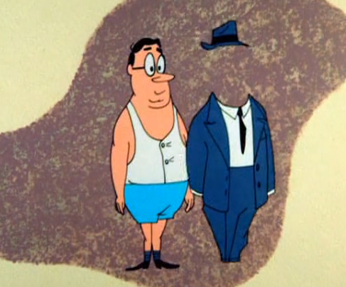
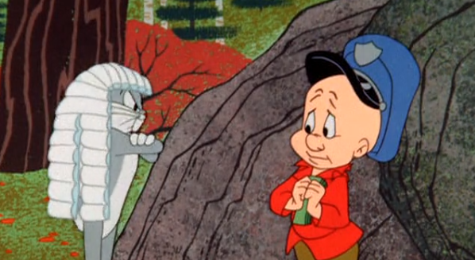

# DDICE4010: Digital Identities, Fall 2020

**Instructor:** Dr. Aaron Ottinger

**Email:** aottinger@seattleu.edu

**Office:** Online

**Office Hours:** By Appointment

## Course Overview 

In "Bugs' Bonnets" (1956), Elmer Fudd is chasing Bugs Bunny, as is typical, but there are hats that have spilled out of a truck and keep falling from the sky, landing on the heads of Buggs and Elmer Fudd. With each new hat, they assume a new personality. The episode opens with a little lesson about the effect that clothes have on one's identity: "It is a well-known psychological fact that peoples' behavior is strongly affected by the way they dress."

As the cartoon unfolds, it becomes clear that power dynamics can also change as one's identity is transformed. 

If we were to pursue this analysis, we might explore the ways that these costumes draw on stereotypes for their power (as when Bugs wears the hair and feathers intended to represent a Native American) and thereby uphold systems of oppression based on a racist system. 

With the digital age it might seem that we are past all of the above. As it turns out, rather than dismantling the above scenarios, the internet has to a large extent merely recoded them. People from marginalized communities might subvert present-day power dynamics in carnivalesque acts of masquerade online. More likely, the internet, including social media, search engines, video games, and data bases are used to reinforce white supremacy and systemic racism, reinforcing particular identities and power dynamics. In part, this class explores how the supposed liberation digital technology was supposed to bring inaugurate merely transformed the wheels of oppression inherited from the pre-digital era, what Ruha Benjamin calls "the New Jim Code." To examine this process in action, in the first module students will analyze search engines, in the manner of Sofiya Umoja Noble, and assess if the information they provide is "the best" or if it is, on the contrary, racist, misogynistic, or violent in some other respect. 

As students of Digital Technology and Cultures, we will go beyond analyzing what already is. Remaining committed to social justice, we will also imagine ways to remake the digital domain in more inclusive and equitable ways, for example, by designing video games and characters that actually represent the gamers who play them. Parallel to this design project, we will explore the cognitive processes bound up with avatars and gaming and how they might (or might not) break down the biases filtering our perceptions, thoughts, and feelings. 

Last, students will investigate digital identities in terms of the digital citizen and the individual’s relationship to the state. Topics will include DNA and reparations, surveillance and policing, as well as death and dying—online. From these topics, students will choose a more specific angle to research for a final multimodal project, for instance, a graphic novel, a website, a documentary, or a wireframe for an app. This final project will be accompanied by a short reflection outlining the rhetorical situation of the artifact (i.e. the project’s problem, purpose, audience, medium, and genre). 

## Aknowledgements 

>First and foremost, I would like to thank our library liaison, Reilly Curran, for her hard work, time, and assistance in procuring many of the resources for this class. I would like to thank Paul Barrett for recommending "I May Destroy You." Last, I thank Elena Chernock for our endless conversations about identity, race, and politics, online and offline. 

## Course Outcomes 

The Course Outcomes for this class are the same as the Learning Outcomes for the department. However, to make sense of these outcomes in the context of a History of Text Technologies, each outcome will require a little qualification. In addition, every assignment in this course corresponds with one or more Learning Outcome. In each assignment, the corresponding Learning Outcomes will be qualified further to illustrate how it fits the task at hand.

### 1. EXPLAIN KEY CONCEPTS IN COMPUTING: This outcome focuses your ability to explain key concepts in computing, media production, and internet-enabled communication.

Throughout the term, there will be key concepts introduced, pertaining either to the history of text technologies, the study of text technologies, or the text technologies themselves. Oftentimes, students will find these key concepts designated by a DEFINITION page. However, new concepts are introduced throughout the modules, often with links to external guides or source materials.

### 2. EVALUATE RESEARCH SOURCES & DIGITAL TOOLS: This outcome focuses on your ability to evaluate the relative strengths and weaknesses of research sources, digital tools, interfaces, and technologies. 

Students will encounter a number of critics, historians, and theorists throughout the term, and will have opportunities to compare, contrast, and synthesize these theories and outlooks. In addition, students will have the opportunity to compare "old" and "new" technologies for an audience of their choice (Module 2). Last, throughout the term, students will compare and contrast technological aids to reading and writing, from pen and paper to optical character recognition software.

### 3. ANALYZE TECHNOLOGY USING INTERDISCIPLINARY THEORIES & METHODS: This outcome focuses on your ability to analyze new and emerging media using interdisciplinary theories and methods. 

Students will analyze ancient, modern, and digital technologies using frameworks provided by a variety of theorists and critics. Students will also employ a variety of methodologies, from hands-on exploration to "distant reading."

### 4. EXAMINE TECHNOLOGICALLY MEDIATED IDENTITIES: This outcome focuses on your ability to examine how technology changes sense of self and transforms ideologies of gender, nationality, ethnicity, sexuality, and social class. 

One of the fundamental questions of this class is: Who is included and excluded from the history of text technologies? While we will sometimes think of the technological mediation of humans, more generally, we will also consider the differences between technological innovation around the globe and its positive and negative consequences for women, BIPOC, and disabled communities.

### 5. DESIGN MULTIMODAL PROJECTS: This outcome focuses on your ability to design socially responsible multimodal projects using digital rhetoric and audience engagement strategies. 

Students will write traditional, college-level research papers, but they will also create multimodal projects involving video, text, and data visualization.

### 6. REFLECTION: This outcome focuses on your ability to reflect upon your own work, roles, values, and identities related to digital culture and engagement with social justice issues.

Rather than ask students to wait until the end of the course to share their personal thoughts and feelings with respect to course materials, each module will end with a reflection. Students will complete three major reflections overall. 

## Communication 

### Face-to-Face

I am available meet to "face-to-face" online via Zoom meetings. We will have face-to-face conferences twice during the term, once early on and once towards the end. These meetings will be conducted via Zoom. 

 
### Email

Please email me any questions you have at any time. I recommend using the Canvas email tool ("Inbox" located on the far left navigation bar). But you are welcome to email me directly through the seattleu email system (Outlook). 

While you may email me at any hour, I am more likely to respond to student emails from 9am-6pm, Monday through Friday. I will check email less frequently after 6pm. On the weekends, I will do my best to check and respond to email but that is also time for me to get away from the office and unplug. So beware: if you want to make sure your questions are answered, get them in by the end of the workday on Friday. 

Please allow 24 hours for responses. 

 
### Slack

This class will not use a private Slack channel, but the instructor does post announcements on the #General Slack channel for the whole department. Also Slack is great for sharing news, commenting on the work of your peers, answering questions, and just staying in touch. 

 
### Twitter

I love Twitter (@AaronOttinger). I often post things that I think will be interesting for students using the hashtag #DICE3020. Nothing I post here is required and I will likely crosspost on Slack. The great thing about Twitter is that we can connect with other working professionals that might be able to help us in our discussions. Feel free to engage with me on this platform as well.

## Required Tools and Software

It is recommended that you start by watching the CDLI's [Student Orientation to Distance Learning](https://www.seattleu.edu/cdli/instructional-continuity/student-orientation/).

This course will be fully online, therefore you will need access to an up-to-date device that is capable of playing videos, recording videos and using a camera. If your computer is capable of playing multimedia but doesn't have a webcam, you may be able to use your mobile device to record and upload videos. 

It is essential that you have a reliable broadband network connection available during the course. We recommend cable broadband, DSL, or for mobile devices, availability of LTE. Use of satellite broadband services or WIMAX services such as Clear may not have sufficient bandwidth to allow successful participation in this course. If you can watch Netflix or YouTube videos on high definition without lags, it is likely your broadband connection is sufficient. You should also be aware that some countries block content, such as YouTube videos. If you will be traveling to a country that may block content, please talk to me right away.

### Software

Most of this course will take place within the learning management system Canvas. For their final project, students will also have the opportunity to work with the R programming environment. We will download R in the early weeks of the course to address any issues before the software is required for the course. 

## Community Agreements (student generated)

### Think before acting

- Employ anti-violent, inclusive communication (think about connotations of language, e.g. "lame" is often used as a pejorative adjective. Who would likely find this usage hurtful?) 

- Avoid speaking over one another

### Empower one another

- Be okay with being questioned, but challenge and question with respect (avoid personal attacks)

- Offer solutions

- Ask questions, encourage, and challenge one another. 

### Be accountable

- Be Punctual 

- Be willing to apologize

- Be willing to forgive

## Diversity, Growth, and Future Application

I recognize and respect the diversity of races, genders, sexual identities, classes, ages, and abilities. Differences provide us with opportunities to learn new things, compare experiences, understand ourselves better, and find common ground. Differences also sometimes engender conflict. In the midst of that conflict, I ask everyone to maintain a language and an attitude of respect. 

Bear in mind that some opinions and materials in this class might challenge our personal views and beliefs. But if the goal in this class is to grow cognitively and emotionally, students and the instructor are expected to question the limitations of our personal histories to make room for the personal views and experiences of others. 

Last, consider that the path to emotional and intellectual growth may not be won by challenging one’s own personal beliefs and values only. To embrace new ideas, skills, and values for future use in different contexts, we must also conduct personal investigations that ask why our views are being challenged in the first place. Accordingly, it is always worth asking “Why do I feel x?”, “Why do I believe x?”, and “Why do I value x?” Ultimately, this course is not solely intended to increase our knowledge about a list of terms; more importantly, the task is to alter the fundamental ways in which we understand ourselves and our relationship to ourselves and others within a digital culture.

## Self Care and Caring for One Another

This classroom is a place where everyone is welcome and should feel like they matter. Everyone is encouraged to advocate for themselves. Here are some items to consider:      

**1. Move if you need to: You know your body best.** 

If you need to get up, sit down, go to the bathroom, and so forth, please do so. You do not need permission. This one may be less applicable online, but it does apply to online, one-on-one conferences.

**2. Stay home if you need to:** 

A little less applicable in an online class, it's still  important to let the instructor know if you cannot attend an online meeting. You are encouraged to email the instructor ahead of time, but you do not have to reveal why. Simply stating that you are not well is enough. But if you feel like you need to explain, you are also invited to do so.      

**3. Eat/drink if you need to:** 

If you need to eat or drink in class, please do so. But please try to avoid foods that are going to disrupt your neighbor’s learning. Really pungent or noisy foods might best be saved for the cafeteria. Also, be mindful of spaces (like computer labs) where food is not allowed. Feel free to take a break from these spaces if you need food or drink.       

**4. Speak up, slow down, repeat, stop:**

During lectures and discussions, we may need things said again or slowed down. You are encouraged to ask.      

**5. Be aware of your classmates’ feelings:** 

If someone looks like they are not doing well, ask them, “Are you okay?” Let’s not ignore one another. Let’s not let anyone go unnoticed—unless, of course, someone expresses that they would like to be left alone. Then leave them alone.

**6. In light of the coronavirus: Stay home, wash your hands frequently, and don't touch your face:** 

While we are trying to proceed as normal, there is nothing normal about a pandemic, and everyone is encouraged to follow state guidelines and to take necessary precautions. Please visit [the CDC's website regarding the Coronavirus disease (covid-19)](https://www.cdc.gov/coronavirus/2019-ncov/index.html).

## University Resources

[CANVAS and DIGITAL LEARNING HELP](https://www.seattleu.edu/cdlihelp/?redirect=true)

[LIBRARY and LEARNING COMMONS](https://www.seattleu.edu//learningcommons/)

[WRITING CENTER](https://www.seattleu.edu/writingcenter/)

[LEARNING ASSISTANCE PROGRAMS](https://www.seattleu.edu/learning-assistance/)

[ACADEMIC INTEGRITY TUTORIAL](https://www.seattleu.edu/academic-integrity/?redirect=true)

The following policies govern this course and comply with Seattle University policies.

## Support for Students With Disabilities

If you have, or think you may have, a disability (including an “invisible disability” such as a learning disability, a chronic health problem, or a mental health condition) that interferes with your performance as a student in this class, you are encouraged to arrange support services and/or accommodations through Disabilities Services staff located in Loyola 100, (206) 296- 5740. Disability-based adjustments to course expectations can be arranged only through this process. 

[DISABILITY SERVICES](https://www.seattleu.edu/disability-services/)

## Academic Policies from the SU Registrar

Be sure that you understand the appropriate university academic policies, posted on the Registrar’s website:

   [SU's Academic Policies](https://www.seattleu.edu/redhawk-service-center/academic-policies/)
    
### Incomplete Grades

If you are unable to complete course requirements because of extenuating circumstances, please notify the instructor on or before the date the assignment is due and provide relevant supporting documentation (e.g. doctor’s note, note from counselor).

An agreement to receive an Incomplete (I) grade may be negotiated if your circumstances do not allow you to finish the course on time. The Incomplete Removal Policy of the university is available on the Office of the [Registrar web site](https://www.seattleu.edu/registrar/Policies.aspx). 

## Course Policies

### Assignment Deadlines and Extensions

Assignments should be submitted at the designated due date/time. If a student requies an extension, they should request one from the instructor 24 hours in advance. 

#### Extended Extensions

All assignments from the first four weeks of the quarter will be due no later than the start of week 5. This hard deadline is automatic. Exceptions will require additional permission.

All assignments from the second four weeks of the quarter will be due no later than the start of week 9. This hard deadline is automatic. Exceptions will require additional permission.

## Assignments and Grading 

This course follows a three-module sequence, with each module representing a distinct period in the history of text technologies (ancient, modern, digital). The infographic below outlines this trajectory, starting with an introductory module that asks what we mean by a history of text technologies, followed by a module on ancient reading and writing technologies, succeeded by a section on modern text technologies (from the printing press to the typewriter), and concluding with a module on digital text technologies and a final reflection. Details regarding the kinds of individual assignments are below. 

#### CONFERENCES (2.5 points ea. / 5% total)

Each student will meet with the instructor twice for online, one-on-one conferences. These conferences will take place between weeks 2 & 3 and weeks 7 & 8.

#### DISCUSSIONS (10 points ea. / 20% total)

Each week will be a discussion question for you to explore. These should be 150+ words and will be due by midnight Saturday of each week. I would like you to then comment on two of your peer’s postings by midnight on Sunday. We will discuss these in class during the next in class meeting.

#### SHORT ASSIGNMENTS (20 points ea. / 25% total)

These smaller assignments will help you scaffold the kind of information and research you will need for MAJOR ASSIGNMENTS (below). Typically, we will share these assignments through a discussion board, but they are different from “DISCUSSION BOARD” assignments. The purpose of sharing them through discussion boards is simply to showcase your work and to get some feedback. These assignments will also ask you to go above and beyond understanding and/or responding to the assigned essays for that week. Short assignments might include an experiment, a creative project, or possibly a draft of a larger research paper. 

#### MAJOR ASSIGNMENTS (100 points ea. / 40% total)

We will have three MAJOR ASSIGNMENTS this term. The first is an analysis of search engines and/or social media how they determine personal identities. Our second major assignment includes creating a character for a video game of your own design and a rhetorical analysis of this character and their world. The final analysis will be a traditional research paper or a combination of a multimodal project with research components regarding one of the final course topics, including digital identities and the digital divide, DNA and information, digital surveillance and policing, and digital mortality. Students who wish to pursue a different topic will be encouraged to connect their preferred line of inquiry with one of the above.  

#### REFLECTIONS (10 points ea. / 10% total)

Following major assignment sequences 1, 2 and 3, students will submit reflective essays. These reflective essays demonstrate an understanding of the outcomes fulfilled. Additionally, students will reflect on how the skills acquired in class will apply outside of class. Last, students can use these reflections to discuss how they feel about their research, their findings, and how it all relates to their world and the world at large.

### Grade Scale (screen reader friendly)

| Grade Percentage | GPA | Letter Grade |
| ----------- | ----------- | ----------- |
| between 93 and 100 |between 3.8 and 4.0 | A | 
| between 89 and 92 | between 3.4 and 3.7 | A minus | 
| between 86 and 88 | between 3.1 and 3.3 | B plus | 
| between 83 and 85 | between 2.8 and 3.0 | B | 
| between 79 and 82 | between 2.4 and 2.7 | B minus | 
| between 76 and 78 | between 2.1 and 2.3 | C plus | 
| between 70 and 73 | between 1.8 and 2.0 | C | 
| between 65 and 68 | between 1.4 and 1.7 | C minus | 
| between 62 and 64 | between 1.1 and 1.3 | D plus | 
| between 60 and 61 | between 0.8 and 1.0 | D | 
| between 58 and 59 | between 0.1 and 0.7 | D minus | 
| between 0 and 57 | 0.0 | F | 

# Calendar

| Module / Week | What to Read | What to Complete |
| ----------- | ----------- | ----------- |
| **Module 0.5** | **What Do We Mean by Digital Identities?** |  |
| Week 1: What Do We Mean by Digital Identities? | TEXT: Rettberg, "Written, Visual, and Quantitative Self-Representations" TEXT: Benjamin, "Introduction," from Race After Technology THEORY: Althusser, "Ideology and Ideological State Apparatuses (Notes towards an Investigation)" | DISCUSSION: How Do We Represent Ourselves Online? DISCUSSION: What Does It Mean to be a Subject? Who Gets to be a Subject? SHORT ASSIGNMENT: Interpellated Digitally  |
| **Module 1** | **The Subject Constructed: Search Engines, Selfies, and Social Media** |  |
| Week 2: Search Engines and Subjects | THEORY: Judith Butler. “Critically Queer.” GLQ 1, no. 1(1993): 17–32. CONTEXT: Safiya Umoja Noble, TBD | DISCUSSION: What Does it Mean to be a Subject? SHORT ASSIGNMENT: A Search Engine Cannot Tell You Who You Are  FINAL PROJECT: Preliminary Research: A Scholarly or News Article  |
| Week 3: Selfies, Social Media, and Beyond the Subject | TEXT: “Social Media Is a Great Way to Connect,” I May Destroy You CCONTEXT: Jill Walker Rettberg, “Filtered Reality,” in Seeing Ourselves Through Technology: How We Use Selfies, Blogs and Wearable Devices to See and Shape Ourselves, Springer, 2014. Read pages 20-32. CONTEXT: Jill Walker Rettberg, “Serial Selfies,” in Seeing Ourselves Through Technology: How We Use Selfies, Blogs and Wearable Devices to See and Shape Ourselves, Springer, 2014. Read pages 33-44. THEORY: Nelson, Lise. "Bodies (and Spaces) Do Matter: The Limits of Performativity." Gender, Place & Culture 6, no. 4 (1999): 331-53. | DISCUSSION: Critical Selfies. MAJOR ASSIGNMENT: Constructed Subjects Online: An Analysis. REFLECTION: Module 1. |
| **Module 2** | **The Posthuman Self: Avatars, Embodiment, Representations, and Communities in Video Games** |  |
| Week 4: Virtual Representations and Communities | TEXT: Jason Rohrer, Between (2008). CONTEXT: Ian Bogost, “Can the Other Come Out and Play?” How to Talk About Video Games, University of Minnesota Press, 2015. Read pages: 63-70. CONTEXT: Chris Patterson, “Ludophile: Author \ Auteur / Asian,” Open World Empire: Race, Erotics, and the Global Rise of Video Games. New York University Press, 2020. Read Pages 77-111. CONTEXT: Kishonna L. Gray (2018) Gaming out online: Black lesbian identity development and community building in Xbox Live, Journal of Lesbian Studies, 22:3, 282-296.  | DISCUSSION: How/What Can Video Games Teach Us about Identity? SHORT ASSIGNMENT: Creating Inclusive Characters/Communities. FINAL PROJECT: A Short Annotated Bibliography (5-8 sources) |
| Week 5: Embodiment | TEXT: Aevee Bee, “I Love My Untouchable Virtual Body." THEORY: Hansen, Mark B. N. “Bodies in Code,” Bodies in Code: Interfaces with Digital Media. New York ; London: Routledge, 2008. Web. Read pages 25-104. CONTEXT: Wilde, Poppy, and Adrienne Evans. “Empathy at Play: Embodying Posthuman Subjectivities in Gaming.” Convergence, vol. 25, no. 5–6, Dec. 2019, pp. 791–806. CONTEXT: Elizabeth Behm-Morawitz, Hillary Pennell & Ashton Gerding Speno (2016) The effects of virtual racial embodiment in a gaming app on reducing prejudice, Communication Monographs, 83:3, 396-418. | DISCUSSION: Virtual Bodies and Consequences for the Self. MAJOR ASSIGNMENT: Inclusive Characters/Communities and Embodiment. REFLECTION: Module 2 |
| Week 6: Writing Machines: Women and the Typewriter in Europe and China | TEXT: Victor Saville, Susie Sunshine (film excerpt) CONTEXT: Angelika Führich, "Woman and Typewriter: Gender, Technology, and Work in Late Weimar Film" THEORY: Geoffrey Winthrop-Young, "Media Theory," Kittler and the Media (66-73) CONTEXT: Thomas S. Mullaney, The Chinese Typewriter : A History (Introduction and Chapter 3: Radical Machines)  | 2 Discussion Board Assignments, 1 Timeline Contribution, MAJOR ASSIGNMENT 2, Reflection: Module 2 |
| **Module 3** | **Digital Citizen: Digital Identities, Science, and the State** |  |
| Week 7: Subaltern Digital Identities and the Digital Divide | CONTEXT: Nakamura, Lisa. “Cybertyping and the Work of Race in the Age of Digital Reproduction,” Cybertypes. Taylor and Francis, 2002. Read pages 22-51. CONTEXT: Rayvon Fouché, “From Black Inventors to One Laptop Per Child: Exporting a Racial Politics of Technology,” Race After the Internet. Edited by Lisa Nakamura and Peter Chow-White. Hoboken: Taylor and Francis, 2013. Read pages 61-81. THEORY: Spivak, Gayatri Chakravorty: "Can the Subaltern Speak?". In: Marxism and the Interpretation of Culture. Eds. Cary Nelson and Lawrence Grossberg. Urbana, IL: University of Illinois Press, 1988: 271-313. | DISCUSSION: How Does the Digital Divide Determine Digital Identity? SHORT ASSIGNMENT: The Subaltern and Digital Technology. FINAL PROJECT: An Abstract and Outline  |
| Week 8: Digital Bios: DNA, or Biological Citizenship in a Digital Age | TTHEORY: Benjamin, Ruha. “Locating Biological Citizenship,” People's Science: Bodies and Rights on the Stem Cell Frontier,” Stanford University Press, 2013. Read Pages: 27-54. CONTEXT: Alondra Nelson, Social Life of DNA: Race, Reparations, and Reconciliation After the Genome, 2016. Read Pages: TBD. REFLECTION: Egorova, Yulia. "DNA, Reconciliation and Social Empowerment." The British Journal of Sociology 69.3 (2018): 545-51. Web.   | DISCUSSION: TBD. SHORT ASSIGNMENT: TBD. |
| Week 9: Citizens of a Digital Surveillance State | TEXT: “Nosedive,” Black Mirror, 2016. CONTEXT: Tamara K. Nopper, “Digital Character in "The Scored Society": FICO, Social Networks, and the Competing Measurements of Creditworthimess,” in Captivating Technology: Race, Carceral Technoscience, and Liberatory Imagination in Everyday Life, edited by Ruha Benjamin. Duke, 2019. Read pages 170-187. CONTEXT: Ferguson, Andrew Guthrie. The Rise of Big Data Policing. New York: NYU, 2017. Read pages 1-61. | DISCUSSION: TBD. SHORT ASSIGNMENT: TBD. FINAL PROJECT: Introduction Draft and Peer Review. |
| WEEK 9: Reclaiming Digital Identities | CONTEXT: Ron Eglash, “Anti-Racist Technoscience: A Generative Tradition,” Captivating Technology: Race, Carceral Technoscience, and Liberatory Imagination in Everyday Life, edited by Ruha Benjamin (Duke 2019) Read pages: 227-51. CONTEXT: Lorna Roth, “Making Skin Visible Through Liberatory Design,” Captivating Technology: Race, Carceral Technoscience, and Liberatory Imagination in Everyday Life, edited by Ruha Benjamin (Duke 2019) Read pages: 275-307. | DISCUSSION: How Can Digital Technology Be an Agent of Change and Inclusivity? |
| WEEK 10: Reflections | | FINAL PROJECT: Final Draft. REFLECTION: Video Reflection on the Course and Final Projects. |

