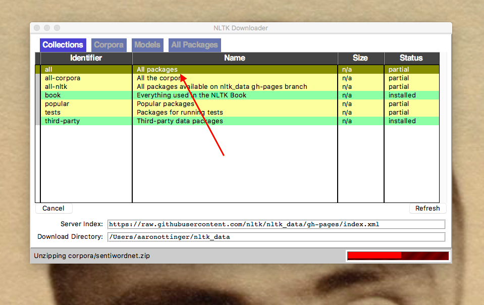
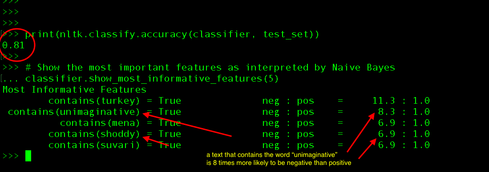

# Getting Started with Sentiment Analysis in Python: Positive and Negative Movie Reviews

Introductory remarks

> Sources: [The NLTK Book](http://www.nltk.org/book/ch06.html) and Syak Paul's article for Data Camp, ["Simplifying Sentiment Analysis in Python"](https://www.datacamp.com/community/tutorials/simplifying-sentiment-analysis-python).

# Directions 	

1. Create a virtual environment in Python (see Dylan Medina’s tutorial [here](https://youtu.be/_fCazmtnUzY)). 

2.	Install natural language processing toolkit (either type in the code below or copy and paste it): 

`pip install nltk`

Either a successful installation of NLTK will follow, or you may find that it has already been installed. 

3. Now open up Python (if the natural language toolkit was already installed, make sure that you're using the corresponding version of Python), and "import" the Natural Language Toolkit. 

`import nltk`

`nltk.download()`

At this point, a pop-up window should appear which lists all the corpora, models, and packages that you can download. Under "Collections," select "All packages."

4. Once you have downloaded "All packages," breath! You've now made it past a major hurdle. Because you have downloaded all of the packages you now have access to a wide variety of datasets, including the Moview Reviews Corpus we're going to use today. If you need to, this really is a good time to walk away and take a breath. 

Yay, movie reivews! But wait, don't get too excited. We're not actually **reading** the moview reviews, as you might read them in *The New Yorker*, or a similar periodical. Our movie reviews have already been compiled into a corpus. Instead, we're going to **classify** each document, otherwise referred to as **document classification**. And we're going to classify each movie review, or each document, as either positive (for a good review) or negative (for a bad review).

> **Pause for Reflection:** What's one problem that you see with classifying documents (movie reviews, in this case) as either postive or negative? Think about the way you feel about some recent films you've watched. Would you be able to classify them as strictly positive or negative? Now, think about how you actually communicate your feelings about a film to different audiences--will all of those audiences register and understand your feedback in the same way? 

5. Now we must load and prepare our dataset by importing the Natural Language Tookit, followed by the Movie Review Corpus, and then we'll organize this corpus at random (**Note:** If you get lost at any point or you if lost your progress, feel free to re-activate your virtual environment and fire up Python). 

       import nltk

       from nltk.corpus import movie_reviews

       import random

       documents = [(list(movie_reviews.words(fileid)), category)

                   for category in movie_reviews.categories()
              
                   for fileid in movie_reviews.fileids(category)]

       random.shuffle(documents)
       
 

