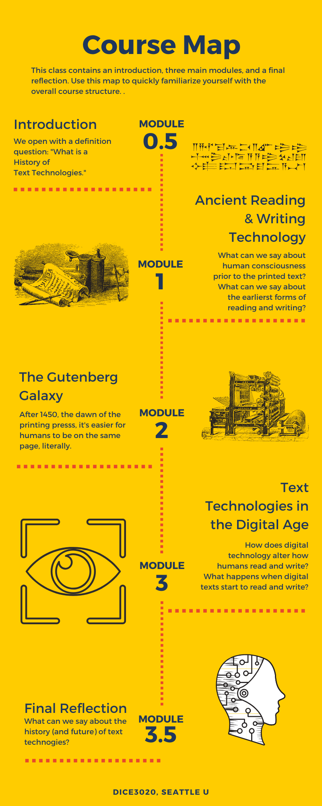

# DICE3020: History of Text Technologies, Spring 2020

**Instructor:** Dr. Aaron Ottinger

**Email:** aottinger@seattleu.edu

**Office:** Harding 240

**Office Hours:** Mondays 4:30-5:30

## Course Overview 

How does a history of text technologies intertwine with the history of human consciousness? While this question might come as a surprise to some, consider that memory, a pillar of human consciousness, must change dramatically with the invention of reading and writing materials, such as the book. With the rise of books, knowledge can be passed from one generation to the next, knowledge that can be studied and re-read, activities far more difficult to achieve in a strictly oral culture. Accordingly, this class focuses on the history of reading and writing technologies, but stakes of this history are grounded in the evolution of human cognitive processess (i.e. memory, attention, decision making, creativity, and more). 

Already a complicated history, this class aims to braoden its scope by taking a global approach and evaluating who is often included in narratives of text technologies and who is often excluded. Furthermore, we will consider how we measure time in a history of text technologies: Is it linear? Cylcical? Recurssive? Is it shallow? Deep? or Really deep?? 

To assist us in all of the aforementioned questions, this class combines historical readings of text technologies, theoretical texts, and methods in distant reading, namely, text mining and visualization. 

This course is an asynchronous online class (i.e. there are regularly scheduled class meetings). Students should expect to spend roughly 10-12 hours per week reading and preparing homework assignments. The course is organized into three modules, each consisting of readings (Text, Context, and Theory), discussion boards, an ongoing collaborative timeline assignment, plus a short assignment that develops into a major assignment. Major assignments will incorporate an array of modes and genres, including a research paper, a video presentation, and a multimodal research paper on the present state of digital reading tools. At least twice throughout the term, students will meet individually with the instructor via an online conferencing platform (Zoom). The final major assignment and final reflection will be due during finals week, but there will be no final exam. 

## Course Outcomes 

## Aknowledgements 

I would like to thank Jordan Kraemer, Kathryn Nogue, Eugenia Zuroski, Emma Zuroski, Corinne Cath-Speth, Hined A. Rafeh, Jaclyn (@j_nfoster), Blair Stein, David Krankauer, Emily Yates-Doerr, Michael, Bacon, Kevin MacDonnell, and @praymurray. Many of these folks amplified or responded to a request for text recommendations. I am also inspired daily by the work of Dania Glabau. And for years, my brother, Christopher Ottinger, a practicing artist and media archaeologist, has referred me to pertinent works of art and criticism, in addition to entertaining my many questions.

## Community Agreements

### Think before acting

- Employ anti-violent, inclusive communication (think about connotations of language, e.g. "lame" is often used as a pejorative adjective. Who would likely find this usage hurtful?) 

- Avoid speaking over one another

### Empower one another

- Be okay with being questioned, but challenge and question with respect (avoid personal attacks)Offer solutions

- Ask questions, encourage, and challenge one another. 

### Be accountable

- Be Punctual 

- Be willing to apologize

- Be willing to forgive

## Assignments and Grading 

### Short and Major Assignments

### Grade Breakdown 

| Grade Percentage | GPA | Letter Grade |
| ----------- | ----------- | ----------- |
| 93-100 | 3.8-4.0 | A | 
| 89-92 | 3.4-3.7 | A- | 
| 86-88 | 3.1-3.3 | B+ | 
| 83-85 | 2.8-3.0 | B | 
| 79-82 | 2.4-2.7 | B- | 
| 76-78 | 2.1-2.3 | C+ | 
| 70-73 | 1.8-2.0 | C | 
| 65-68 | 1.4-1.7 | C- | 
| 62-64 | 1.1-1.3 | D+ | 
| 60-61 | 0.8-1.0 | D | 
| 58-59 | 0.1-0.7 | D- | 
| 0-57 | 0.0 | F | 

## Communication 

### Face-to-Face

I am available to meet between Monday and Friday during my office hours or by appointment. I am happy to meet in the office or at a cafe on or near campus. 

I can also meet "face-to-face" online via Zoom meetings. We will have face-to-face conferences twice during the term, once early on and once towards the end. These meetings will be conducted via Zoom (unless you elect to meet on Campus). 

 
### Email

Please email me any questions you have at any time. I recommend using the Canvas email tool ("Inbox" located on the far left navigation bar). But you are welcome to email me directly through the seattleu email system (Outlook). 

While you may email me at any hour, I am more likely to respond to student emails from 9am-6pm, Monday through Friday. I will check email less frequently after 6pm. On the weekends, I will do my best to check and respond to email but that is also time for me to get away from the office and unplug. So beware: if you want to make sure your questions are answered, get them in by the end of the workday on Friday. 

Please allow for at least 24 hours for responses. 

 
### Slack

This class will not use a private Slack channel, but the instructor does post announcements on the #General Slack channel for the whole department. Also Slack is great for sharing news, commenting on the work of your peers, answering questions, and just staying in touch. 

 
### Twitter

I love Twitter (@AaronOttinger). I often post things that I think will be interesting for students using the hashtag #DICE3020. Nothing I post here is required and I will likely crosspost on Slack. The great thing about Twitter is that we can connect with other working professionals that might be able to help us in our discussions. Feel free to engage with me on this platform as well.

## Required Tools and Software

## Diversity, Growth, and Future Application

I recognize and respect the diversity of races, genders, sexual identities, classes, ages, and abilities. Differences provide us with opportunities to learn new things, compare experiences, understand ourselves better, and find common ground. Differences also sometimes engender conflict. In the midst of that conflict, I ask everyone to maintain a language and an attitude of respect. 

Bear in mind that some opinions and materials in this class might challenge our personal views and beliefs. But if the goal in this class is to grow cognitively and emotionally, students and the instructor are expected to question the limitations of our personal histories to make room for the personal views and experiences of others. 

Last, consider that the path to emotional and intellectual growth may not be won by challenging one’s own personal beliefs and values only. To embrace new ideas, skills, and values for future use in different contexts, we must also conduct personal investigations that ask why our views are being challenged in the first place. Accordingly, it is always worth asking “Why do I feel x?”, “Why do I believe x?”, and “Why do I value x?” Ultimately, this course is not solely intended to increase our knowledge about a list of terms; more importantly, the task is to alter the fundamental ways in which we understand ourselves and our relationship to ourselves and others within a digital culture.

## Self Care and Caring for Others

This classroom is a place where everyone is welcome and should feel like they matter. Everyone is encouraged to advocate for themselves. Here are some items to consider:      

1. Move if you need to: You know your body best. 

If you need to get up, sit down, go to the bathroom, and so forth, please do so. You do not need permission.      

2. Stay home if you need to: 

A litle less applicable in an online class, it's still  important to let the instructor know if you cannot attend an online meeting. You are encouraged to email the instructor ahead of time, but you do not have to reveal why. Simply stating that you are not well is enough. But if you feel like you need to explain, you are also invited to do so.      

3. Eat/drink if you need to: 

If you need to eat or drink in class, please do so. But please try to avoid foods that are going to disrupt your neighbor’s learning. Really pungent or noisy foods might best be saved for the cafeteria. Also, be mindful of spaces (like computer labs) where food is not allowed. Feel free to take a break from these spaces if you need food or drink.       

4. Speak up, slow down, repeat, stop: 

During lectures and discussions, we may need things said again or slowed down. You are encouraged to ask.      

5. Be aware of your classmates’ feelings: 

If someone looks like they are not doing well, ask them, “Are you okay?” Let’s not ignore one another. Let’s not let anyone go unnoticed—unless, of course, someone expresses that they would like to be left alone. Then leave them alone.

## University Resources

CANVAS HELP (Links to an external site.)

LIBRARY AND LEARNING COMMONS (Links to an external site.)

WRITING CENTER (Links to an external site.)

LEARNING ASSISTANCE PROGRAMS (Links to an external site.)

ACADEMIC INTEGRITY TUTORIAL (Links to an external site.)

The following policies govern this course and comply with Seattle University policies.
Support for Students With Disabilities

If you have, or think you may have, a disability (including an “invisible disability” such as a learning disability, a chronic health problem, or a mental health condition) that interferes with your performance as a student in this class, you are encouraged to arrange support services and/or accommodations through Disabilities Services staff located in Loyola 100, (206) 296- 5740. Disability-based adjustments to course expectations can be arranged only through this process. 

DISABILITY SERVICES (Links to an external site.)
Academic Policies from the SU Registrar

Be sure that you understand the following university academic policies, posted on the Registrar’s website:

    ACADEMIC INTEGRITY POLICY
    ACADEMIC GRADING GRIEVANCE POLICY 
    Policy on Religious Accommodations for Students (Links to an external site.)

https://www.seattleu.edu/registrar/academics/performance/ (Links to an external site.) (Links to an external site.) 
Incomplete Grades

If you are unable to complete course requirements because of extenuating circumstances, please notify the instructor on or before the date the assignment is due and provide relevant supporting documentation (e.g. doctor’s note, note from counselor).

An agreement to receive an Incomplete (I) grade may be negotiated if your circumstances do not allow you to finish the course on time. The Incomplete Removal Policy of the university is available on the Office of the Registrar web site: https://www.seattleu.edu/registrar/Policies.aspx (Links to an external site.) (Links to an external site.) 
Assignment Deadlines and Extensions

Assignment deadlines are visible on both the Course Syllabus and the Assignment List (as well as the individual Assignment pages themselves). You can always find links to those two pages in the left sidebar of the course. If an emergency arises, please contact me. Extensions are not a given. They must be granted.  

Due to the nature of the work, and the online structure of the course materials, assignment deadlines will be automatically enforced. Generally, there will be no extensions to the assignment deadlines, primarily because falling behind on work in this course makes it exponentially more difficult to complete the course successfully.

Because our face to face sessions are limited, missing class sessions can have a negative impact on your learning experience, and that of your colleagues.  If you feel you must miss a session, and you know beforehand, you will need to consult with me, schedule a 30 minute 1 on 1, and demonstrate prior completion of coursework.  

If an emergency arises, please alert me as soon as you can to schedule a meeting to explore next steps.  My goal is for you to succeed, so please communicate with me.

An agreement to receive an Incomplete (I) grade may be negotiated if your circumstances do not allow you to finish the course on time. The Incomplete Removal Policy of the university is available on the Office of the Registrar web site: https://www.seattleu.edu/registrar/Policies.aspx 
Student Responsibilities for Learning

You are expected to budget 10 hours per week for this course. Most of the time, this will be adequate time to complete all of the requirements for each week. However, given the nature of the material in these courses, it is likely that some weeks will be more time-consuming than others due to complexity of concepts. Please communicate openly with your instructor about how the course is going and let your instructor know if you are regularly spending a lot more time to complete work. Additional tutoring or other assistance may be available depending on the nature of the issue. You are also encouraged to review the calendar at the beginning of the quarter to flag any weeks that seem to you to be especially full or challenging.

# Calendar

| Module / Week | What to Read | What to Complete |
| ----------- | ----------- | ----------- |
| Module 0.5 | What is a History of Text Technologies |  |
| Week 1: What is a History of Text Technologies? | 1. Rousseau, Discourse on Inequality 2. Jerome McGann, "Why Textual Scholarship Matters?" 3. Marvin, "Introduction," When Old Technologies Were New. 4. Michael Haworth, "Bernard Stiegler on Transgenerational Memory and the Dual Origin of the Human" | 2 Discussion Board Assignments |
| Module 1 | Ancient Reading and Writing Technologies |  |
| Week 2: Orality and Writing Before the Greek Alphabet | 1. Text | 2 Discussion Board Assignments, Short Assignment 1 |
| Week 3: Early Writing and Books Around the Globe | 1. Text | 2 Discussion Board Assignments |
