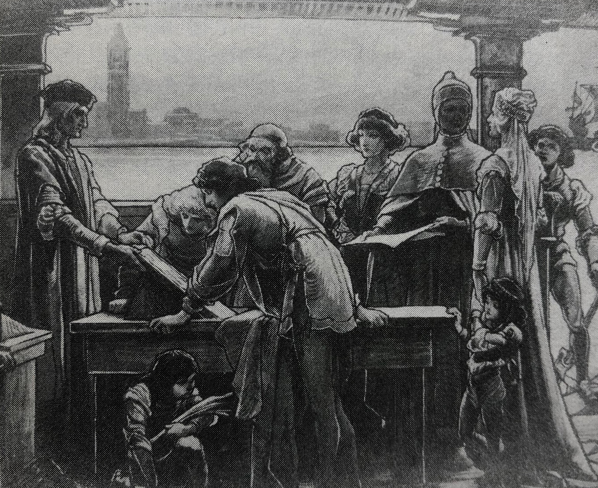
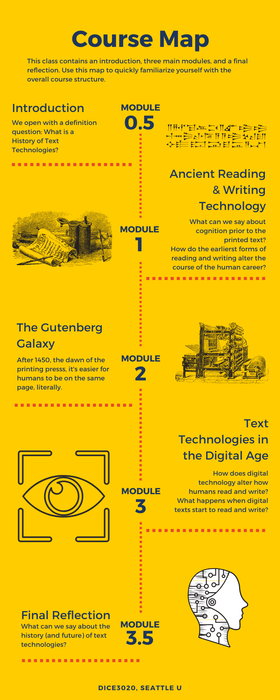
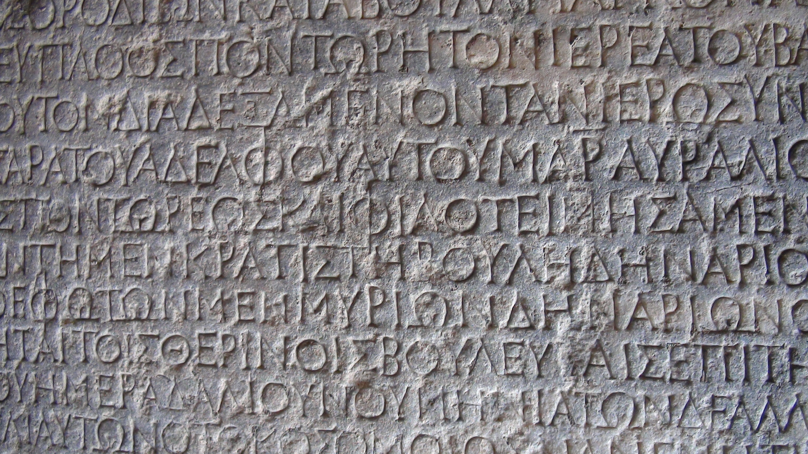

# DICE3020: History of Text Technologies, Spring 2020

**Instructor:** Dr. Aaron Ottinger

**Email:** aottinger@seattleu.edu

**Office:** Online

**Office Hours:** Mondays 4:30-5:30 or by appointment

## Course Overview 

How does a history of text technologies intertwine with the history of human consciousness? While this question might come as a surprise to some, consider that memory, a pillar of human consciousness, must change dramatically with the invention of reading and writing materials, such as the book. With the rise of books, knowledge can be passed from one generation to the next, knowledge that can be studied and re-read, activities far more difficult to achieve in a strictly oral culture. Accordingly, this class focuses on the history of reading and writing technologies, but stakes of this history are grounded in the evolution of human cognitive processes (i.e. memory, attention, decision making, creativity, and more). 

Already a complicated history, this class aims to braoden its scope by taking a global approach and evaluating who is often included in narratives of text technologies and who is often excluded. Furthermore, we will consider how we measure time in a history of text technologies: Is it linear? Cylcical? Recurssive? Is it shallow? Deep? or Really deep?? 

To assist us in all of the aforementioned questions, this class combines historical readings of text technologies, theoretical texts, and methods in distant reading, namely, text mining and visualization. 

This course is an asynchronous online class (i.e. there are regularly scheduled class meetings). Students should expect to spend roughly 10-12 hours per week reading and preparing homework assignments. The course is organized into three modules, each consisting of readings (Text, Context, and Theory), discussion boards, an ongoing collaborative timeline assignment, plus a short assignment that develops into a major assignment. Major assignments will incorporate an array of modes and genres, including a research paper, a video presentation, and a multimodal research paper on the present state of digital reading tools. At least twice throughout the term, students will meet individually with the instructor via an online conferencing platform (Zoom). The final major assignment and final reflection will be due during finals week, but there will be no final exam. 

## Aknowledgements 

>I would like to thank Jordan Kraemer, Kathryn Nogue, Eugenia Zuroski, Emma Zuroski, Corinne Cath-Speth, Hined A. Rafeh, Jaclyn (@j_nfoster), Blair Stein, David Krankauer, Emily Yates-Doerr, Michael, Bacon, Kevin MacDonnell, and @praymurray. Many of these folks amplified or responded to a request for text recommendations. I am also inspired daily by the work of Dania Glabau. And for years, my brother, Christopher Ottinger, a practicing artist and media archaeologist, has referred me to pertinent works of art and criticism, in addition to entertaining my many questions.

## Course Outcomes 

The Course Outcomes for this class are the same as the Learning Outcomes for the department. However, to make sense of these outcomes in the context of a History of Text Technologies, each outcome will require a little qualification. In addition, every assignment in this course corresponds with one or more Learning Outcome. In each assignment, the corresponding Learning Outcomes will be qualified further to illustrate how it fits the task at hand.

### 1. EXPLAIN KEY CONCEPTS IN COMPUTING: This outcome focuses your ability to explain key concepts in computing, media production, and internet-enabled communication.

Throughout the term, there will be key concepts introduced, pertaining either to the history of text technologies, the study of text technologies, or the text technologies themselves. Oftentimes, students will find these key concepts designated by a DEFINITION page. However, new concepts are introduced throughout the modules, often with links to external guides or source materials.

### 2. EVALUATE RESEARCH SOURCES & DIGITAL TOOLS: This outcome focuses on your ability to evaluate the relative strengths and weaknesses of research sources, digital tools, interfaces, and technologies. 

Students will encounter a number of critics, historians, and theorists throughout the term, and will have opportunities to compare, contrast, and synthesize these theories and outlooks. In addition, students will have the opportunity to compare "old" and "new" technologies for an audience of their choice (Module 2). Last, throughout the term, students will compare and contrast technological aids to reading and writing, from pen and paper to optical character recognition software.

### 3. ANALYZE TECHNOLOGY USING INTERDISCIPLINARY THEORIES & METHODS: This outcome focuses on your ability to analyze new and emerging media using interdisciplinary theories and methods. 

Students will analyze ancient, modern, and digital technologies using frameworks provided by a variety of theorists and critics. Students will also employ a variety of methodologies, from hands-on exploration to "distant reading."

### 4. EXAMINE TECHNOLOGICALLY MEDIATED IDENTITIES: This outcome focuses on your ability to examine how technology changes sense of self and transforms ideologies of gender, nationality, ethnicity, sexuality, and social class. 

One of the fundamental questions of this class is: Who is included and excluded from the history of text technologies? While we will sometimes think of the technological mediation of humans, more generally, we will also consider the differences between technological innovation around the globe and its positive and negative consequences for women, people of color, and disabled communities.

### 5. DESIGN MULTIMODAL PROJECTS: This outcome focuses on your ability to design socially responsible multimodal projects using digital rhetoric and audience engagement strategies. 

Students will write traditional, college-level research papers, but they will also create multimodal projects involving video, text, and data visualization.

### 6. REFLECTION: This outcome focuses on your ability to reflect upon your own work, roles, values, and identities related to digital culture and engagement with social justice issues.

At various touchstones throughout the term will be punctuated by reflective writing. Rather than ask students to wait until the end of the course to share their personal thoughts and feelings, reflections will be incorporated into each module.

## Communication 

### Face-to-Face

I am available to meet between Monday and Friday during my office hours or by appointment. I am happy to meet in the office or at a cafe on or near campus. 

I can also meet "face-to-face" online via Zoom meetings. We will have face-to-face conferences twice during the term, once early on and once towards the end. These meetings will be conducted via Zoom (unless you elect to meet on Campus). 

 
### Email

Please email me any questions you have at any time. I recommend using the Canvas email tool ("Inbox" located on the far left navigation bar). But you are welcome to email me directly through the seattleu email system (Outlook). 

While you may email me at any hour, I am more likely to respond to student emails from 9am-6pm, Monday through Friday. I will check email less frequently after 6pm. On the weekends, I will do my best to check and respond to email but that is also time for me to get away from the office and unplug. So beware: if you want to make sure your questions are answered, get them in by the end of the workday on Friday. 

Please allow 24 hours for responses. 

 
### Slack

This class will not use a private Slack channel, but the instructor does post announcements on the #General Slack channel for the whole department. Also Slack is great for sharing news, commenting on the work of your peers, answering questions, and just staying in touch. 

 
### Twitter

I love Twitter (@AaronOttinger). I often post things that I think will be interesting for students using the hashtag #DICE3020. Nothing I post here is required and I will likely crosspost on Slack. The great thing about Twitter is that we can connect with other working professionals that might be able to help us in our discussions. Feel free to engage with me on this platform as well.

## Required Tools and Software

It is recommended that you start by watching the CDLI's [Student Orientation to Distance Learning](https://www.seattleu.edu/cdli/instructional-continuity/student-orientation/).

This course will be fully online, therefore you will need access to an up-to-date device that is capable of playing videos, recording videos and using a camera. If your computer is capable of playing multimedia but doesn't have a webcam, you may be able to use your mobile device to record and upload videos. 

It is essential that you have a reliable broadband network connection available during the course. We recommend cable broadband, DSL, or for mobile devices, availability of LTE. Use of satellite broadband services or WIMAX services such as Clear may not have sufficient bandwidth to allow successful participation in this course. If you can watch Netflix or YouTube videos on high definition without lags, it is likely your broadband connection is sufficient. You should also be aware that some countries block content, such as YouTube videos. If you will be traveling to a country that may block content, please talk to me right away.

### Software

Most of this course will take place within the learning management system Canvas. For their final project, students will also have the opportunity to work with the R programming environment. We will download R in the early weeks of the course to address any issues before the software is required for the course. 

## Community Agreements

### Think before acting

- Employ anti-violent, inclusive communication (think about connotations of language, e.g. "lame" is often used as a pejorative adjective. Who would likely find this usage hurtful?) 

- Avoid speaking over one another

### Empower one another

- Be okay with being questioned, but challenge and question with respect (avoid personal attacks)Offer solutions

- Ask questions, encourage, and challenge one another. 

### Be accountable

- Be Punctual 

- Be willing to apologize

- Be willing to forgive

## Diversity, Growth, and Future Application

I recognize and respect the diversity of races, genders, sexual identities, classes, ages, and abilities. Differences provide us with opportunities to learn new things, compare experiences, understand ourselves better, and find common ground. Differences also sometimes engender conflict. In the midst of that conflict, I ask everyone to maintain a language and an attitude of respect. 

Bear in mind that some opinions and materials in this class might challenge our personal views and beliefs. But if the goal in this class is to grow cognitively and emotionally, students and the instructor are expected to question the limitations of our personal histories to make room for the personal views and experiences of others. 

Last, consider that the path to emotional and intellectual growth may not be won by challenging one’s own personal beliefs and values only. To embrace new ideas, skills, and values for future use in different contexts, we must also conduct personal investigations that ask why our views are being challenged in the first place. Accordingly, it is always worth asking “Why do I feel x?”, “Why do I believe x?”, and “Why do I value x?” Ultimately, this course is not solely intended to increase our knowledge about a list of terms; more importantly, the task is to alter the fundamental ways in which we understand ourselves and our relationship to ourselves and others within a digital culture.

## Self Care and Caring for Others

This classroom is a place where everyone is welcome and should feel like they matter. Everyone is encouraged to advocate for themselves. Here are some items to consider:      

1. Move if you need to: You know your body best. 

If you need to get up, sit down, go to the bathroom, and so forth, please do so. You do not need permission.      

2. Stay home if you need to: 

A little less applicable in an online class, it's still  important to let the instructor know if you cannot attend an online meeting. You are encouraged to email the instructor ahead of time, but you do not have to reveal why. Simply stating that you are not well is enough. But if you feel like you need to explain, you are also invited to do so.      

3. Eat/drink if you need to: 

If you need to eat or drink in class, please do so. But please try to avoid foods that are going to disrupt your neighbor’s learning. Really pungent or noisy foods might best be saved for the cafeteria. Also, be mindful of spaces (like computer labs) where food is not allowed. Feel free to take a break from these spaces if you need food or drink.       

4. Speak up, slow down, repeat, stop: 

During lectures and discussions, we may need things said again or slowed down. You are encouraged to ask.      

5. Be aware of your classmates’ feelings: 

If someone looks like they are not doing well, ask them, “Are you okay?” Let’s not ignore one another. Let’s not let anyone go unnoticed—unless, of course, someone expresses that they would like to be left alone. Then leave them alone.

6. In light of the coronavirus: Stay home, wash your hands frequently, and don't touch your face: 

While we are trying to proceed as noraml, there is nothing normal about a pandemic, and everyone is encouraged to follow state guidelines and to take necessary precautions. Please visit [the CDC's website regarding the Coronavirus disease (covid-19)](https://www.cdc.gov/coronavirus/2019-ncov/index.html).

## University Resources

[CANVAS and DIGITAL LEARNING HELP](https://www.seattleu.edu/cdlihelp/?redirect=true)

[LIBRARY and LEARNING COMMONS](https://www.seattleu.edu//learningcommons/)

[WRITING CENTER](https://www.seattleu.edu/writingcenter/)

[LEARNING ASSISTANCE PROGRAMS](https://www.seattleu.edu/learning-assistance/)

[ACADEMIC INTEGRITY TUTORIAL](https://www.seattleu.edu/academic-integrity/?redirect=true)

The following policies govern this course and comply with Seattle University policies.

## Support for Students With Disabilities

If you have, or think you may have, a disability (including an “invisible disability” such as a learning disability, a chronic health problem, or a mental health condition) that interferes with your performance as a student in this class, you are encouraged to arrange support services and/or accommodations through Disabilities Services staff located in Loyola 100, (206) 296- 5740. Disability-based adjustments to course expectations can be arranged only through this process. 

[DISABILITY SERVICES](https://www.seattleu.edu/disability-services/)

## Academic Policies from the SU Registrar

Be sure that you understand the appropriate university academic policies, posted on the Registrar’s website:

   [SU's Academic Policies](https://www.seattleu.edu/redhawk-service-center/academic-policies/)
    
### Incomplete Grades

If you are unable to complete course requirements because of extenuating circumstances, please notify the instructor on or before the date the assignment is due and provide relevant supporting documentation (e.g. doctor’s note, note from counselor).

An agreement to receive an Incomplete (I) grade may be negotiated if your circumstances do not allow you to finish the course on time. The Incomplete Removal Policy of the university is available on the Office of the [Registrar web site](https://www.seattleu.edu/registrar/Policies.aspx). 

## Course Policies

### Assignment Deadlines and Extensions

Assignments should be submitted at the designated due date/time. If a student requies an extension, they should request one from the instructor 24 hours in advance. 

#### Extended Extensions

All assignments from the first four weeks of the quarter will be due no later than the start of week 5. This hard deadline is automatic. Exceptions will require additional permission.

All assignments from the second four weeks of the quarter will be due no later than the start of week 9. This hard deadline is automatic. Exceptions will require additional permission.

## Assignments and Grading 

This course follows a three-module sequence, with each module represented a distinct period in the history of text technologies (ancient, modern, digital). The infographic below outlines this trajectory, starting with an introductory module that asks what we mean by a history of text technologies, followed by a module on ancient reading and writing technologies, succeeded by a section on modern text technologies (from the printing press to the type writer), and concluding with a module on digital text technologies and a final reflection. Details regarding the kinds of individual assignments are below. 

#### CONFERENCES (2.5 points ea. / 5% total)

Each student will meet with the instructor twice for online, one-on-one conferences. These conferences will take place between weeks 2 & 3 and weeks 7 & 8 (given the nine week term). 

#### DISCUSSION (10 points ea. / 10% total)

Each week we will have 1-2 discussion board assignments. Typically, these discussion board assignments give students a chance to entertain, challenge, and demonstrate their understanding of course materials. Plus, discussion boards tie into short assignments, which in turn prepare students for major assignments. 

#### TIMELINE (5 points ea. / 5% total) 

Often, history books include a chronology or a timeline, which make for excellent resources. But a timeline can be deceptive. They often reinforce the idea of a linear history towards an ideal good we call "progress." They also tend to exclude much more than they include. In this class, we wil collaborate on creating our own timeline and we will reflect on their epistemological ends. 

#### SHORT ASSIGNMENTS (20 points ea. / 30% total)

Short Assignments are designed to help students get a jumpstart on Major Assignments. They are smaller in scope and lower in stakes. They also allow students to receive feedback before reaching a more critical or decisive point within their research and work. 

#### MAJOR ASSIGNMENTS (100 points / 45% total)

Major assignments wrap up each module. They synthesize what has been read and discussed for each module, and so they tend to cover 2-3 weeks worth of materials. 

- Major Assignment 1: The Psychodynamics of Early Writing Technology

Major assignment one is a traditional college-level essay. Following our first example of Rousseau's Discourse on Inequality, students select a form of early lexigraphic writing from one of the five times/regions examined and meditates on how this particular form of writing might have determined the epistemic state of a particular community in history. As a somewhat speculative endeavor, students are encouraged to use their imagination, while at the same time grounding their claims in the practical and theoretical research discussed in class. 

- Major Assignment 2: The Inclusion and Exclusion of Modern Text Technologies

- Major Assignment 3: Reading, Writing, Thinking, Feeling: Text Technologies in an Algorithmic Culture

#### Reflections (10 points ea. / 5% total)

Following major assignment sequences 2 and 3, students will submit reflective essays. These reflective essays are intended to be meditations on your writing and grading process and decisions. They demonstrate an understanding of the outcomes fulfilled. Additionally, students will reflect on how the skills acquired in class will apply outside of class.

### Grade Scale 

| Grade Percentage | GPA | Letter Grade |
| ----------- | ----------- | ----------- |
| 93-100 | 3.8-4.0 | A | 
| 89-92 | 3.4-3.7 | A- | 
| 86-88 | 3.1-3.3 | B+ | 
| 83-85 | 2.8-3.0 | B | 
| 79-82 | 2.4-2.7 | B- | 
| 76-78 | 2.1-2.3 | C+ | 
| 70-73 | 1.8-2.0 | C | 
| 65-68 | 1.4-1.7 | C- | 
| 62-64 | 1.1-1.3 | D+ | 
| 60-61 | 0.8-1.0 | D | 
| 58-59 | 0.1-0.7 | D- | 
| 0-57 | 0.0 | F | 

# Calendar

| Module / Week | What to Read | What to Complete |
| ----------- | ----------- | ----------- |
| **Module 0.5** | **What is a History of Text Technologies** |  |
| Week 1: What is a History of Text Technologies? | 1. Rousseau, Discourse on Inequality 2. Jerome McGann, "Why Textual Scholarship Matters?" 3. Marvin, "Introduction," When Old Technologies Were New. 4. Michael Haworth, "Bernard Stiegler on Transgenerational Memory and the Dual Origin of the Human" | 2 Discussion Board Assignments |
| **Module 1** | **Ancient Reading and Writing Technologies** |  |
| Week 2: Orality and Writing Before the Greek Alphabet | 1. Text | 2 Discussion Board Assignments, Short Assignment 1 |
| Week 3: Early Writing and Books Around the Globe | 1. Text | 2 Discussion Board Assignments |
| **Module 2** | **The Gutenburg Galaxy** |  |
| Week 4: Early Writing and Books Around the Globe | 1. Text | 2 Discussion Board Assignments |
| Week 5: Early Writing and Books Around the Globe | 1. Text | 2 Discussion Board Assignments |
| Week 6: Early Writing and Books Around the Globe | 1. Text | 2 Discussion Board Assignments |
| **Module 3** | **Text Technologies in the Digital Age** |  |
| Week 7: Early Writing and Books Around the Globe | 1. Text | 2 Discussion Board Assignments |
| Week 8: Early Writing and Books Around the Globe | 1. Text | 2 Discussion Board Assignments |
| Week 9: Early Writing and Books Around the Globe | 1. Text | 2 Discussion Board Assignments |
| FINALS WEEK | No new texts | Major Assignment 3  |

